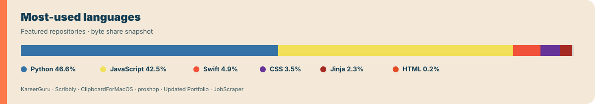
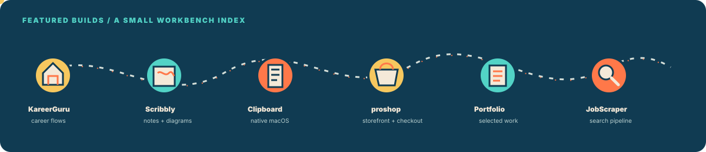

# Full Stack Engineer

React · Redux · Next.js · Node.js · Express · JavaScript · Java

<a href="https://chetansai.vercel.app">Portfolio</a>
&nbsp;&nbsp;·&nbsp;&nbsp;
<a href="mailto:chetansai.official@gmail.com">Email</a>
&nbsp;&nbsp;·&nbsp;&nbsp;
<a href="https://www.linkedin.com/in/chetan-sai-96445a227/">LinkedIn</a>

<table>
<tr>
<td width="72%" valign="middle">

</td>
<td width="28%" valign="middle">

**Reach me**  
[chetansai.official@gmail.com](mailto:chetansai.official@gmail.com)  
[chetansai.vercel.app](https://chetansai.vercel.app)

</td>
</tr>
</table>

## About me

- Full Stack Engineer with 2+ years across a startup and Oracle.
- I build React interfaces, Node.js APIs, REST integrations, webhook flows,
  and the production fixes that connect them.
- Based in Hyderabad, India; open to frontend, backend, and full-stack roles.
- Currently strengthening TypeScript, system design, and data structures.

## Work highlights

- **Oracle:** Worked on a React-based Manufacturing Task Scheduler with Gantt
  visualization and drag-and-drop scheduling, reducing work-order management
  time by about **60%**.
- **Ten20 Infomedia:** Worked across the React UI and Node.js APIs for Alohaa,
  improved dashboard performance by about **40%**, and added webhook delivery
  with RabbitMQ retry handling.

## A few features I worked on

<table>
<tr>
<td width="50%" valign="top">

### VoiceBroadcast

An automated outbound IVR system that uses pre-recorded voices, captures user
responses as DTMF keys, and supports voice surveys and campaigns.

**Flow**  
React campaign UI → Node.js APIs → call-result webhooks → RabbitMQ retry queues

</td>
<td width="50%" valign="top">

### NumberMasking

A privacy-protection feature where people can talk without exposing their real
phone numbers. I worked on the React flows, Node.js APIs, REST integrations,
and 12+ use cases backed by 200+ automated tests.

**Flow**  
React flows → Node.js / REST APIs → privacy-focused call routing → audit logging

</td>
</tr>
</table>

## Build board

The projects below are the repositories I’d put in front of a recruiter first.

## Project notes

<table>
<tr>
<td width="50%" valign="top">

### [KareerGuru](https://github.com/chetansai123/KareerGuru)

Career-assistance product with resume, cover-letter, quiz, and
industry-insight flows.

`Next.js` `React` `Prisma`

</td>
<td width="50%" valign="top">

### [Scribbly](https://github.com/chetansai123/scribbly)

A hand-drawn notebook that turns plain notes and arrow notation into formatted
notes and diagrams.

`JavaScript` `HTML` `CSS`

</td>
</tr>
<tr>
<td width="50%" valign="top">

### [ClipboardForMacOS](https://github.com/chetansai123/ClipBoardForMacOS)

Native macOS menu-bar clipboard history with search, keyboard navigation, and
click-to-paste.

`Swift` `macOS`

</td>
<td width="50%" valign="top">

### [proshop](https://github.com/chetansai123/proshop)

A full-stack e-commerce reference architecture connecting product browsing,
cart state, and checkout flows.

`JavaScript` `React` `Node.js`

</td>
</tr>
<tr>
<td width="50%" valign="top">

### [Updated Portfolio](https://github.com/chetansai123/Updated-Portfolio)

Portfolio site for selected work, experience, and contact details.

`JavaScript` `UI`

</td>
<td width="50%" valign="top">

### [JobScraper](https://github.com/chetansai123/JobScraper)

Strict job-search pipeline that filters by stack, experience, location, and
salary, then verifies direct application links.

`Python` `Jinja2`

</td>
</tr>
</table>

## Toolkit

**Frontend** — React, JavaScript, Redux, Next.js, HTML, CSS  
**Backend** — Node.js, Express, REST APIs, webhooks  
**Data and delivery** — MongoDB, MySQL, RabbitMQ, Docker, Git  
**Additional exposure** — Java for legacy enterprise debugging; TypeScript is
currently in progress.

## Let’s connect

I’m looking for JavaScript-focused frontend, backend, or full-stack
opportunities in India.
